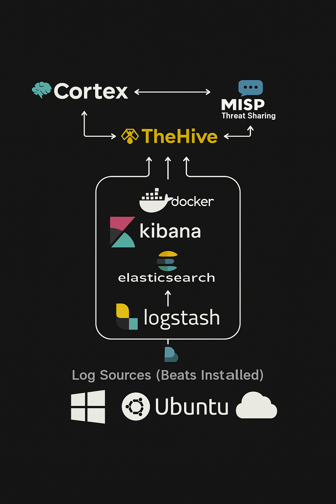

# SOC Real-Time Lab Setup using Free Software

This project demonstrates a practical setup of a Security Operations Center (SOC) using only free and open-source tools. The goal is to simulate real-time detection, investigation, and response workflows within a lab environment.

## Objective

To build and document a complete, end-to-end SOC lab that can:
- Collect and visualize logs
- Simulate incident alerts
- Enrich threat intelligence
- Manage case investigations
- Perform automated analysis

This setup is suitable for cybersecurity learners, blue teamers, and security analysts preparing for real-world SOC environments.

## Tools and Technologies

- **TheHive v4** – Case management and collaborative incident response
- **Cortex** – Automated observable analysis engine
- **MISP** – Threat intelligence platform (feeds, indicators, sharing)
- **ELK Stack** – Log collection, processing, and visualization:
  - **Elasticsearch**
  - **Logstash**
  - **Kibana**
- **Ubuntu (EC2)** – OS used for setting up components in AWS environment

## Architecture

The following diagram illustrates the architecture of the SOC lab:

Architecture

<p align="center">
  
</p>

<p align="center"><em>Figure 1: SOC Real-Time Lab Architecture Overview</em></p>

## Setup Overview

Each component is installed and configured on separate virtual machines (EC2 instances) running Ubuntu. The components are integrated to enable real-time communication and data flow between threat feeds, alert dashboards, and response workflows.

- **TheHive** connects to **Cortex** for observable enrichment
- **Cortex** runs analyzers and responders for automated triage
- **MISP** provides threat feeds and IOCs to both Cortex and TheHive
- **ELK Stack** collects and visualizes system, application, and security logs

## Key Screenshots

All screenshots are available in the `screenshots/` directory.

- TheHive Web Interface
- Cortex API Key Creation
- MISP Feed Setup
- Kibana Dashboard

## Folder Structure

```
soc-real-time-lab/
├── architecture/
│   └──architecture.png
├── screenshots/
│   ├── thehive_web_interface.png
│   ├── cortex_api_key_creation.png
│   ├── misp_feed_setup.png
│   └── kibana_dashboard.png
├── config/
│   ├── thehive_config_sample.conf
│   ├── cortex_config_sample.conf
│   └── misp_config_notes.txt
├── notes/
│   └── troubleshooting.md
└── README.md
```

## Use Cases Demonstrated

- Simulated case creation and triage using TheHive
- Observable analysis via Cortex responders
- IOC and threat feed enrichment using MISP
- Centralized log monitoring and dashboards with Kibana
- Hands-on understanding of how a SOC environment works

## Future Improvements

- Integration with Sigma rules for alert generation
- Use of sysmon/log sources from a Windows machine
- Automation using Python scripts or SOAR

## Disclaimer

This project is for educational and demonstration purposes only. The setup was built in a controlled lab environment and is not intended for production use.
